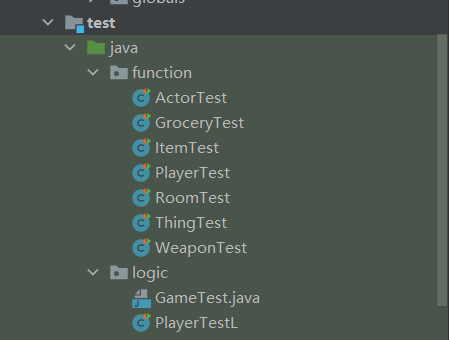

**Features**

* Movement
* Map
* Level
* Enemies
* Shop System
* Battle System
* Weapon
* Item System
* Inventory System
* Treasure System

**Game Engine**

AdventureGame1

Collingbourne, H. The Little Book Of Adventure Game Programming. Retrieved 26 September 2022, from <http://bitwisebooks.com/>

[AdventureGame1.zip](uploads/ceac956ceab9514bbb6c66fb5a41e7a2/AdventureGame1.zip)

**Game Tester**

JUnit4 used for Game Tester

JUnit API. (2006). Retrieved 1 October 2022, from [https://junit.org/junit4/javadoc/latest/](https://junit.org/junit4/javadoc/latest/)

[resources](uploads/602251ceb2c2042facd6c6f949c2a636/resources.zip) (JUnit4)

[Game Tester](uploads/fc3e4435d455072076140bbf4f6dd9eb/Game_Tester.zip) (Examples/Screen Shots)

For test cases, we`ve created detailed JUnit 4 tests for the project. They cover most of the methods in the project, and considers different potential situations that the user might encounter. 

For Game Tester, in this project, we use a Gradle test CI auto game tester. Whenever a change is made to the project, the CI would automatically check the change can pass our tests. And if they don`t, we would be able to reject the merge in time. 

**Game Description**

AdventureGame is a single-player text RPG java game where you will embark on a journey as a hero. Experience different environments in your journey, various enemies, different ways to face your adversaries, and exciting shop mechanics where you can make your hero stronger. Begin your journey now!