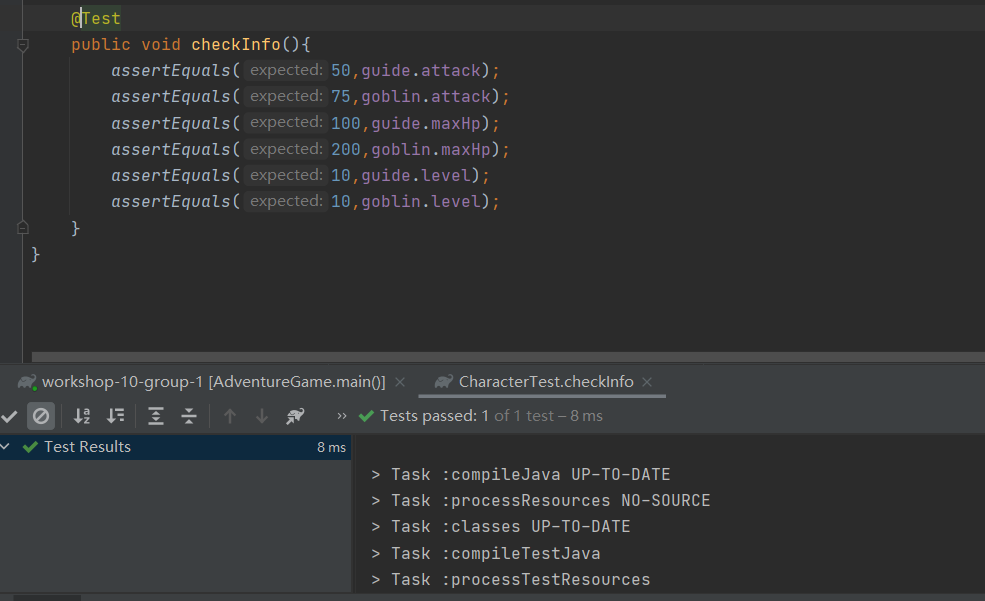
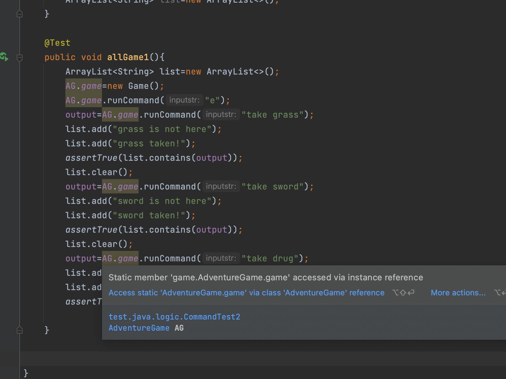
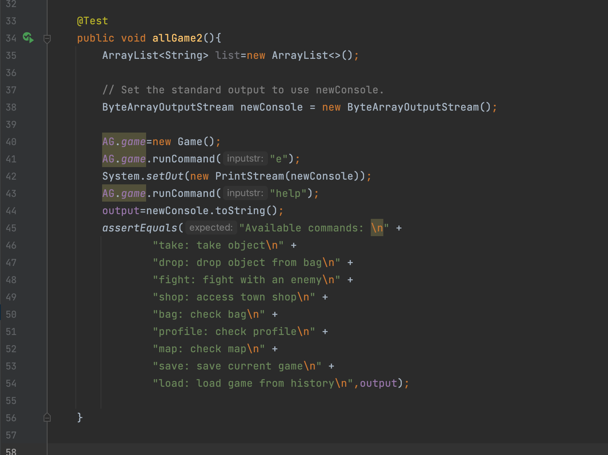
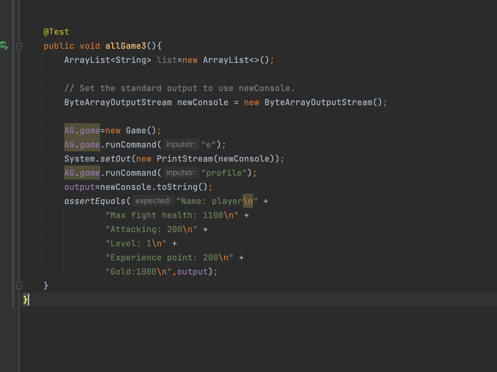

JUnit4 testing for the game and all the game objects.

* Testing types

In this project, we used different ways to test the functionality of the game, so that various situation users might encounter can be all considered. 

For methods that directly return a certain value, we set up test cases of different values to test whether the methods would return the right result. For example, this test below:

For methods that require user input, we use InputStream to setup possible inputs that the user might enter. Then, based on different inputs, we generate different test cases to handle different results. For example, in this test below:

The following command tests are to test by passing commands

