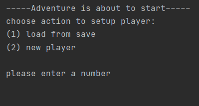
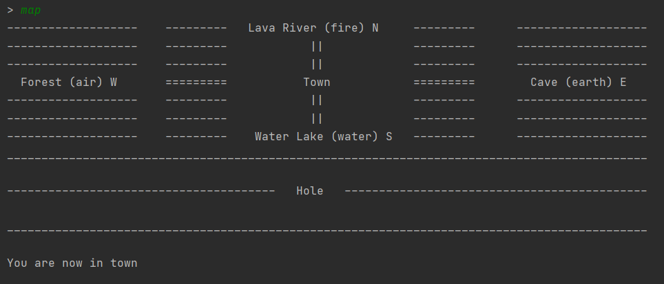
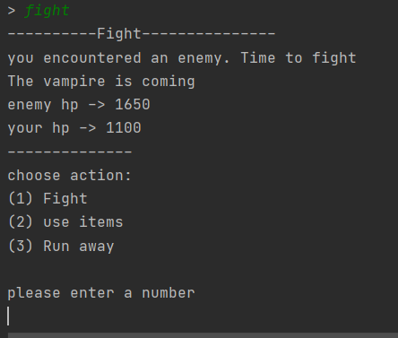

# How to start?

After the game is started in the terminal, you will see the following:

If you`ve already played the game on this device and you want to continue your previous progress, please enter '1' to choose the "load from save" function, which would allow you to choose from records of play history that was saved earlier. While if you are a new player or you just want to experience the game from the start, please enter '2' to start a new game. Then, you would be able to start the adventure.

# Moving in the game

After you entered the game, you would be able to move around and explore the game map. By entering "map", you may see a visualized map of the game, as below:

By default, every time you enter the game, you would start in the Town. The commands "n, s, w, e, d" corresponds to north, south, west, east and down directions. The "Down" direction is only available in the Town, and it would allow you to enter the Dungeon, yet enemies here are also more powerful. By entering theses commands, you may move around in the game as you wish. Note: Special things might happen after you enter the Dungeon! 

# Fighting in the game

When you enter any room other than the Town, you would encounter a random enemy. By entering the "fight" command, you can choose to fight with the enemy. 

By entering numbers 1, 2, 3, you may choose to attack the enemy, use an item in your bag, or run away from the fight. After the enemy is defeated, you would be able to gain exp and gold. So defeat as many enemies as you can and become stronger!

# Finishing the game

In the game, your ultimate goal is to defeat the evil magician, "VOID". He is very mysterious, no one knows exactly where he is, yet there are rumors saying that he lives deep within the dungeon. After you find and defeat him, the game will be considered ended. However, you would still be free to go around and explore more in the game if you wish. 