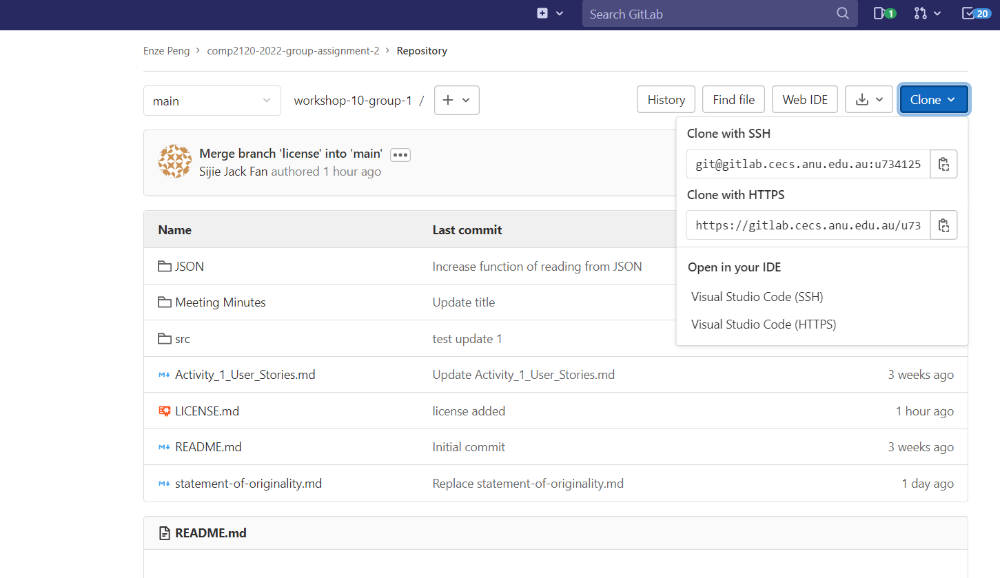
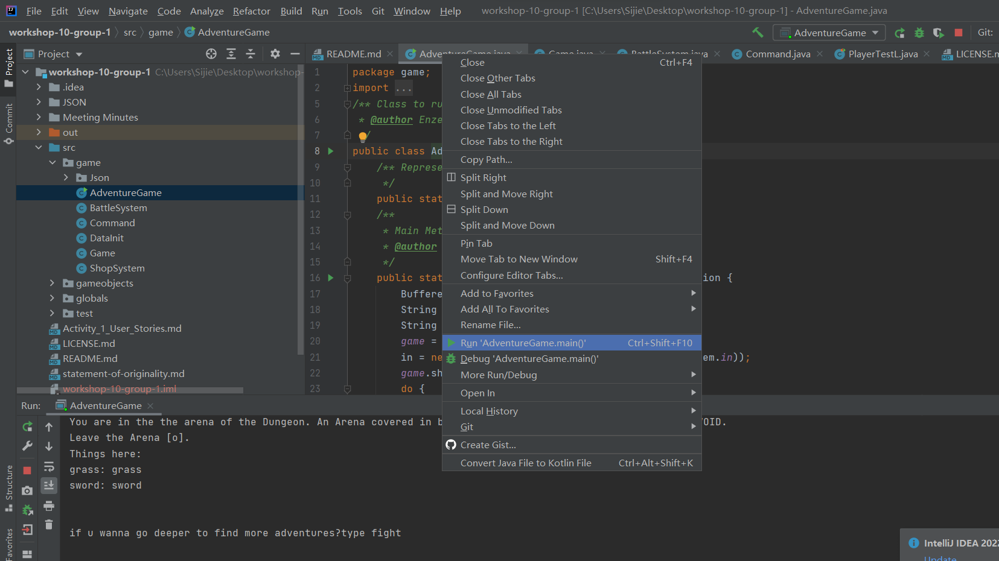
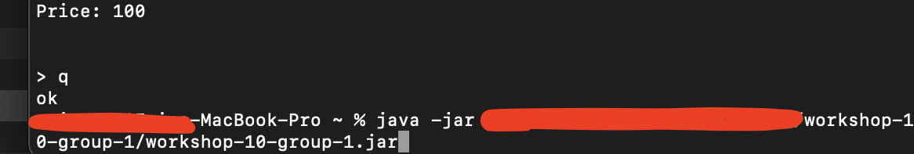
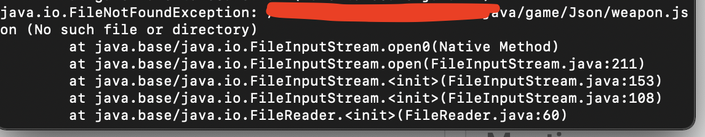
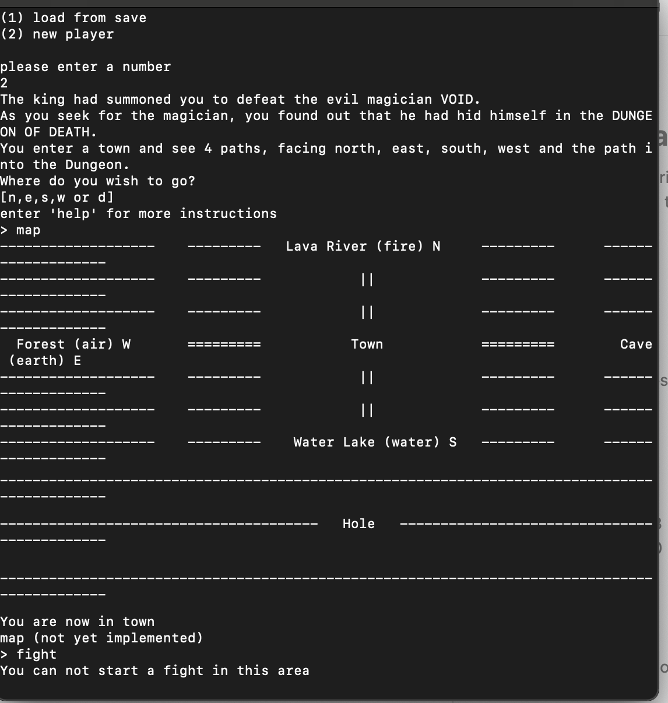

# Before install

To install the game, you must first have an IDE that can run Java code in terminal (Intellji, Eclipse and etc). You would also need to down JDK 18 or above on your device, as that is the minimal requirement to run the game.

# Install Instruction

**- option 1: fork and clone the project to your local**
(recommend to use, since it would be fully functional )

First, you would need to go to the gitlab repo, as in the link below:

https://gitlab.cecs.anu.edu.au/u7341252/workshop-10-group-1/-/tree/main

In here, clone the repo into your own IDE:

After the repo is cloned, selected the file src/game/AdventureGame and run:

Then, you would be able to start the game in terminal.

**- option2: user jar.file** 
(recommend **not** to use it due to incompatible setup, small part of function s would be missing)

link: https://gitlab.cecs.anu.edu.au/u7341252/workshop-10-group-1/-/blob/main/workshop-10-group-1.jar

first download the link file(or clone it and run in terminal)

Then run it file in terminal

Mac:
find the jar.file path: 
then enter java -jar [jar.file-path]

Bug:
if u run it in jar file, you only can create a new player to get into the game
Due to json file path name incompatible and lack of time to fix it, save/load function won't be available 

but it would be all good to use save/load function in cloned project running in IDE (IntelliJ)

but u still can fix it by change the json file path manually
95% functions can be run perfectly in jar

